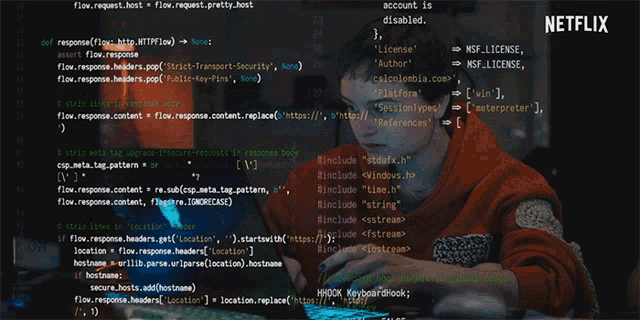

<h1 align='center'> Hi Developer :wave: , I'm Suvrodeb Howlader.</h1>

### 
 <b>A passionate Full Stack Developer</b> 

<!-- Typing Animation -->

  

# About Me

## 👋 Hello, I'm Suvrodeb Howlader!

I'm a passionate Mern Stack developer with a B.Sc. in Computer Science from North Western University. I enjoy building interactive and user-friendly web applications. My journey in web development started with a curiosity for how websites work and has since grown into a full-fledged career.

### 🌟 Skills

<!-- for badge: img.shields.io badge for nextjs -->

- **Languages**:
  
  
  
  
- **Frameworks**:
  
  
  
  
- **Libraries**
  
  
  
  
- **Tools**:
  
  
  
  
  
  

- **Databases**:
  
  

### 📚 Education

- **B.Sc. in Computer Science** - North Western University

### 🌱 Currently Learning

- Advanced Mern Pattern

### 💼 Projects

- **bTolet**
  - Description: Market Place Application built by react.
  - Live Site: [bTolet](https://btolet.com/)
- **Weaverr it**
  - Description: IT firm website made by React and Firebase.
  - Live Site: [Weaverr IT](https://radiant-kitsune-d7e6d2.netlify.app/)
- **Bistro Boss**

  - Description: An art gallery website showcasing Bangladeshi art.
  - Live Site: [Bistro Boss](https://mybistroboss.netlify.app/home)

      

      

    <!-- 
    
    
    
    
    
    
    
    
 -->

### 📈 GitHub Activity

## ┌─» WORK »────────────

 

 
<!-- ### 🛠️ Languages Used -->

<!-- ### 📊 GitHub Stats -->

 

Feel free to customize this template further according to your preferences. The badges for Commit Count and Daily Streak now use the Dev Metrics style with customized labels and colors. Let me know if there are any other adjustments you would like to make!

### 📫 Let’s Connect:

<h1 align='center'><i>Stay awesome!</i></h1>
<!-- 

 -->

<!--  -->

<!-- Needed -->
<!-- Search: img.shields.io badge for react -->
<!-- React badge:  -->
<!--  -->
